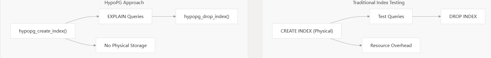
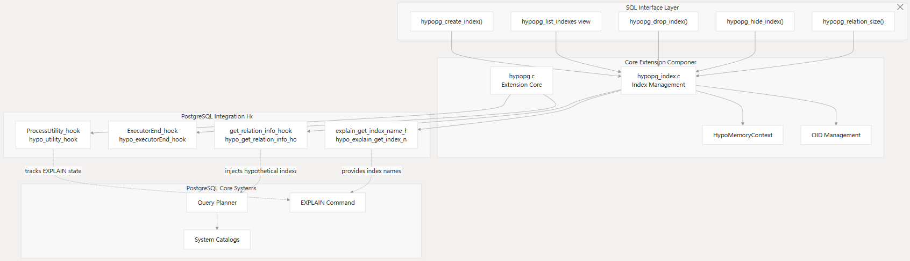
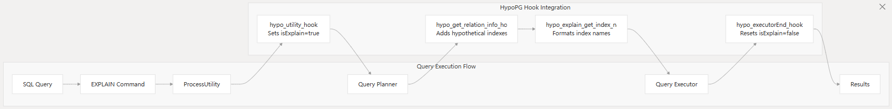

## PostgreSQL虚拟索引扩展hypopg
hypopg是一个PostgreSQL扩展，它新增了对假设性索引（或称虚拟索引）的支持。假设性索引是一种实际并不存在的索引，因此创建时不会消耗 CPU、磁盘或其他资源。它的主要作用是帮助判断特定索引是否能提升有问题的查询性能。通过假设性索引，你可以验证 PostgreSQL是否会使用这些索引优化查询，而无需实际创建索引并付出资源代价。


### 使用场景
hypopg通过虚拟索引（假设索引）技术，帮助用户在不实际创建物理索引的情况下评估索引对查询性能的影响。在以下场景中非常有用：如果你想验证某些索引是否能优化一个或多个查询的性能。此时，你应已经明确需要优化的查询，并对尝试的索引方案有初步设想。



此外，hypopg创建的假设性索引（虚拟索引）不会存储在任何系统目录中，而是保存在当前连接的私有内存中。因此，它们不会导致系统表膨胀，也不会影响其他并发连接。同时，由于这些虚拟索引实际并不存在，hypopg会确保它们仅在执行EXPLAIN语句（且不包含ANALYZE选项时）被使用。

### 使用方法

#### 安装：
```sql
CREATE EXTENSION hypopg;
```

#### 配置参数：
   
| 参数 | 说明 |
| --- | --- |
| hypopg.enabled | 是否启用hypopg，默认值为on, 当hypopg插件被禁用时，虚拟索引不会被使用，但是已经被创建的虚拟索引不会被删除。|
| hypopg.use_real_oids | 是否使用真实的对象标识符，默认值为off。off：hypopg不会使用真实的对象标识符（oid），而是从空闲范围中选择一个标识符。这些标识符由数据库保留以供在未来版本中使用（即FirstNormalObjectId以下的未使用OID）。由于空闲标识符范围是在第一次创建使用hypopg时动态计算得到的，且有能够在备用（Standby）服务器上使用的优势，因此这样不会产生任何问题。但缺点是：同一时间最多只能创建约 2500 个虚拟索引，一旦超过最大对象数量，创建新虚拟索引的速度会显著下降，直到调用 hypopg_reset() 清空为止。on：hypopg可以使用真实的对象标识符（oid）。hypopg.use_real_oids可以避免索引超过最大值创建新的虚拟索引时间漫长的问题。hypopg会请求一个真实的标识符，这将需要获得更多的锁资源，且不能在备用服务器上使用，但允许使用所有标识符。需要注意的是，切换此参数时不需要重置现有虚拟索引条目，两种模式（真实 OID 与虚拟 OID）可以同时共存。 | 


#### 使用限制
当前仅支持如下索引:
- btree
- brin
- hash (requires PostgreSQL 10 or above)
- bloom (requires the bloom extension to be installed)  

不支持ANALYZE，仅EXPLAIN。

#### 创建虚拟索引
可通过函数`hypopg_create_index`创建虚拟索引。通过一个示例进行说明：
```sql
CREATE TABLE hypo (id integer, val text) ;
INSERT INTO hypo SELECT i, 'line ' || i FROM generate_series(1, 100000) i ;
VACUUM ANALYZE hypo ;
```
当前这个表没有任何索引，我们想要验证一下新增一个索引对查询性能的影响。首先我们看一下当前的执行计划：
```sql
EXPLAIN SELECT val FROM hypo WHERE id = 1;
                       QUERY PLAN
--------------------------------------------------------
 Seq Scan on hypo  (cost=0.00..1791.00 rows=1 width=14)
   Filter: (id = 1)
(2 rows)
```
因为当前表没有任何索引，所以执行计划中使用了顺序扫描。我们认为新增一个B-tree索引，可以提高查询性能。通过使用`hypopg_create_index`函数创建一个虚拟索引，参数为标准的`CREATE INDEX`语句。
```sql
SELECT * FROM hypopg_create_index('CREATE INDEX ON hypo (id)') ;
 indexrelid |      indexname
------------+----------------------
      18284 | <18284>btree_hypo_id
(1 row)
```
函数返回两列：虚拟索引的OID以及索引名。
我们查看一下此时的执行计划：
```sql
EXPLAIN SELECT val FROM hypo WHERE id = 1;
                                    QUERY PLAN
----------------------------------------------------------------------------------
 Index Scan using <18284>btree_hypo_id on hypo  (cost=0.04..8.06 rows=1 width=10)
   Index Cond: (id = 1)
(2 rows)
```
可以看到，此时优化器使用了索引。同时，我们查看一下虚拟索引是否能够被实际执行。
```sql
EXPLAIN ANALYZE SELECT val FROM hypo WHERE id = 1;
                        QUERY PLAN
----------------------------------------------------------------------
 Seq Scan on hypo  (cost=0.00..1791.00 rows=1 width=10) (actual time=0.046..46.390 rows=1 loops=1)
   Filter: (id = 1)
   Rows Removed by Filter: 99999
 Planning time: 0.160 ms
 Execution time: 46.460 ms
(5 rows)
```
可以看到，虚拟索引是没有被执行的，也不应该被执行。

#### 虚拟索引操作方法

##### hypopg_list_indexes
列出所有已创建的虚拟索引。
```sql
SELECT * FROM hypopg_list_indexes ;
 indexrelid |      index_name       | schema_name | table_name | am_name
------------+-----------------------+-------------+------------+---------
      18284 | <18284>btree_hypo_id  | public      | hypo       | btree
(1 row)
```

##### hypopg
以和pg_index相同的格式列出所有已创建的虚拟索引。
```sql
SELECT * FROM hypopg() ;
      indexname       | indexrelid | indrelid | innatts | indisunique | indkey | indcollation | indclass | indoption | indexprs | indpred | amid
----------------------+------------+----------+---------+-------------+--------+--------------+----------+-----------+----------+---------+------
 <18284>btree_hypo_id |      13543 |    18122 |       1 | f           | 1      | 0            | 1978     | <NULL>    | <NULL>   | <NULL>  |  403
(1 row)
```

##### hypopg_get_indexdef(oid)
通过虚拟索引标识符得到实际的`CREATE INDEX`命令。
```sql
SELECT index_name, hypopg_get_indexdef(indexrelid) FROM hypopg_list_indexes ;
      index_name       |             hypopg_get_indexdef
-----------------------+----------------------------------------------
 <18284>btree_hypo_id  | CREATE INDEX ON public.hypo USING btree (id)
(1 row)
```

##### hypopg_relation_size(oid)
预估虚拟索引大小。
```sql
SELECT index_name, pg_size_pretty(hypopg_relation_size(indexrelid))
  FROM hypopg_list_indexes ;
      index_name       | pg_size_pretty
-----------------------+----------------
 <18284>btree_hypo_id  | 2544 kB
(1 row)
```

##### hypopg_drop_index(oid)
删除给定标识符的虚拟索引。

##### hypopg_reset()
删除所有虚拟索引。


#### 假设性隐藏索引
可以假设性隐藏现有的和虚拟的索引。如需按照文档中的说明进行测试，应首先调用`hypopg_reset()`以清除所有之前创建的虚拟索引对当前会话的影响。虚拟索引同样可以被隐藏。
举个示例，创建2个虚拟索引：
```sql
SELECT hypopg_reset();
CREATE INDEX ON hypo(id);
CREATE INDEX ON hypo(id, val);
EXPLAIN SELECT * FROM hypo WHERE id = 1;
                        QUERY PLAN
------------------------------------------------------------------
Index Only Scan using hypo_id_val_idx on hypo  (cost=0.29..8.30 rows=1 width=13)
Index Cond: (id = 1)
(2 rows)
```
执行计划使用`hypo_id_val_idx`索引。

**hypopg_hide_index(oid)** 函数会允许你隐藏一个索引，在使用EXPLAIN的时候。
```sql
SELECT hypopg_hide_index('hypo_id_val_idx'::REGCLASS);
 hypopg_hide_index
-------------------
t
(1 row)

EXPLAIN SELECT * FROM hypo WHERE id = 1;
                            QUERY PLAN
-------------------------------------------------------------------------
Index Scan using hypo_id_idx on hypo  (cost=0.29..8.30 rows=1 width=13)
Index Cond: (id = 1)
(2 rows)
```

**hypopg_unhide_index(oid)** 恢复隐藏的索引。
```sql
SELECT hypopg_unhide_index('hypo_id_idx'::regclass);
 hypopg_unhide_index
-------------------
t
(1 row)

EXPLAIN SELECT * FROM hypo WHERE id = 1;
                            QUERY PLAN
-------------------------------------------------------------------------
Index Scan using hypo_id_idx on hypo  (cost=0.29..8.30 rows=1 width=13)
Index Cond: (id = 1)
(2 rows)
```

**hypopg_unhide_all_index()** 恢复所有隐藏的索引。

**hypopg_hidden_indexes()** 列出所有隐藏的索引OID。
```sql
SELECT * FROM hypopg_hidden_indexes();
 indexid
---------
526604
(1 rows)
```

**hypopg_hidden_indexes** 该视图返回被隐藏的索引的信息
```sql
SELECT * FROM hypopg_hidden_indexes;
  indexrelid |      index_name      | schema_name | table_name | am_name | is_hypo
-------------+----------------------+-------------+------------+---------+---------
      526604 | hypo_id_val_idx      | public      | hypo       | btree   | f
(1 rows)
```

### 实现原理
hypopg是通过扩展的方式实现的，我们看一下它都使用了哪些钩子，是理解其实现原理的关键。


虚拟索引的核心实现是虚拟索引注入机制：

执行`hypopg_create_index`函数创建虚拟索引，实质是创建一个`hypoIndex`对象，类似`IndexOptInfo`，描述了索引的元信息。

当执行`EXPLAIN`语句时，进入钩子`hypo_utility_hook`函数，执行`hypo_is_simple_explain`函数判断当前语句是否为`EXPLAIN`语句而不是`ANALYZE`模式。如果不是`EXPLAIN ANALYZE`，则设置`isExplain = true`。

在查询规划阶段，也就是`pg_plan_query`阶段， 会通过`hypo_get_relation_info_hook`将匹配的虚拟索引添加到表的索引列表`RelOptInfo->indexlist`中。
```c++
hypopg.so!hypo_estimate_index(hypoIndex * entry, RelOptInfo * rel) (contrib\hypopg\hypopg_index.c:1864)
hypopg.so!hypo_injectHypotheticalIndex(PlannerInfo * root, Oid relationObjectId, _Bool inhparent, RelOptInfo * rel, Relation relation, hypoIndex * entry) (contrib\hypopg\hypopg_index.c:1139)
hypopg.so!hypo_get_relation_info_hook(PlannerInfo * root, Oid relationObjectId, _Bool inhparent, RelOptInfo * rel) (contrib\hypopg\hypopg.c:528)
get_relation_info(PlannerInfo * root, Oid relationObjectId, _Bool inhparent, RelOptInfo * rel) (src\backend\optimizer\util\plancat.c:510)
build_simple_rel(PlannerInfo * root, int relid, RelOptInfo * parent) (src\backend\optimizer\util\relnode.c:307)
add_base_rels_to_query(PlannerInfo * root, Node * jtnode) (src\backend\optimizer\plan\initsplan.c:114)
add_base_rels_to_query(PlannerInfo * root, Node * jtnode) (src\backend\optimizer\plan\initsplan.c:122)
query_planner(PlannerInfo * root, query_pathkeys_callback qp_callback, void * qp_extra) (src\backend\optimizer\plan\planmain.c:166)
```
其中，统计信息格外关键，会通过调用`hypo_estimate_index`函数，根据假设索引hypoIndex和表的统计信息RelOptInfo估算该索引的元组数（根据选择率进行估算，表元组数*选择率=索引元组数）和占用的页面数（索引大小）。索引大小，不同的索引有不同的估算方法。

后续查询优化器会根据表信息，选择合适的访问访问方法（比如索引扫描，全表扫描）。
```sql
create_index_paths(PlannerInfo * root, RelOptInfo * rel) (src\backend\optimizer\path\indxpath.c:280)
set_plain_rel_pathlist(PlannerInfo * root, RelOptInfo * rel, RangeTblEntry * rte) (src\backend\optimizer\path\allpaths.c:786)
set_rel_pathlist(PlannerInfo * root, RelOptInfo * rel, Index rti, RangeTblEntry * rte) (src\backend\optimizer\path\allpaths.c:501)
set_base_rel_pathlists(PlannerInfo * root) (src\backend\optimizer\path\allpaths.c:353)
make_one_rel(PlannerInfo * root, List * joinlist) (src\backend\optimizer\path\allpaths.c:223)
query_planner(PlannerInfo * root, query_pathkeys_callback qp_callback, void * qp_extra) (src\backend\optimizer\plan\planmain.c:276)
```



最后在`EXPLAIN`输出中显示虚拟索引信息，输出执行计划结果。

更多可参考[虚拟索引实现原理](https://deepwiki.com/search/_f343e71f-97fc-4e65-ae1d-ee503c5ae3f1)

### 总结

虚拟索引有助于我们验证某些索引是否能优化一个或多个查询的性能。使用虚拟索引相比直接创建物理索引，可以节约创建索引的时间以及资源开销。通过下面的例子，可以看到虚拟索引创建的时间非常短，当表非常大时，创建物理索引的时间可能会非常长，此时采用虚拟索引进行验证，能够极大提高工作效率。
```sql
postgres=# CREATE TABLE hypo (id integer, val text);
CREATE TABLE
postgres=# INSERT INTO hypo SELECT i, 'line ' || i FROM generate_series(1, 1000000) i;
INSERT 0 1000000
postgres=# VACUUM ANALYZE hypo;
VACUUM
postgres=# SELECT * FROM hypopg_create_index('CREATE INDEX ON hypo (id)');
 indexrelid |      indexname       
------------+----------------------
      12993 | <12993>btree_hypo_id
(1 row)

Time: 1.852 ms
postgres=# CREATE INDEX idx_id_hypo ON hypo (id);
CREATE INDEX
Time: 1277.969 ms (00:01.278)
```
> 创建虚拟索引非常快的原因是它只是创建了索引元数据，不需要创建索引物理页面，不用扫描源表堆表去构建索引物理页面。


---

参考文档：
[Hypothetical indexes for PostgreSQL](https://hypopg.readthedocs.io/en/rel1_stable/))
[hypopg（虚拟索引）](https://help.aliyun.com/zh/polardb/polardb-for-postgresql/hypopg?spm=a2c4g.11186623.help-menu-2249963.d_7_9.53a249539FjqcS)
[hypopg deepwiki](https://deepwiki.com/HypoPG/hypopg)