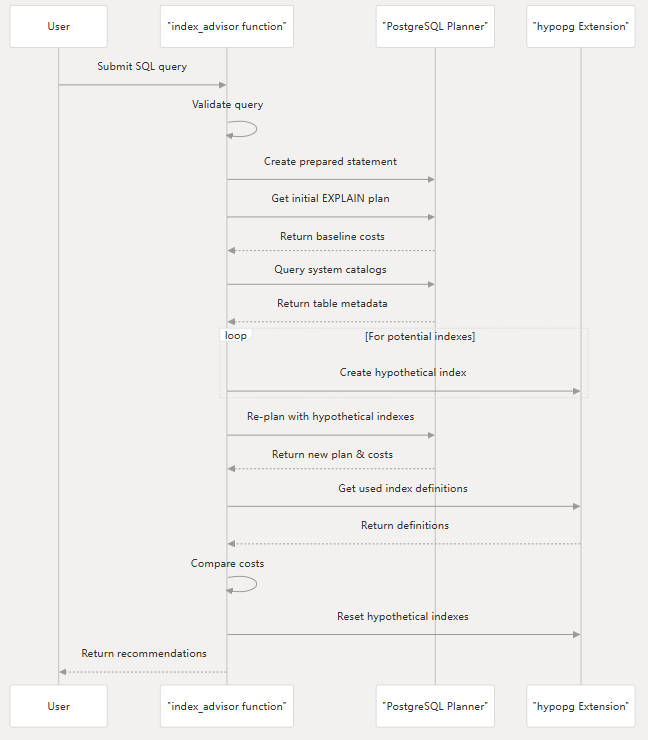

## PostgreSQL索引推荐扩展index_advisor
当前主流数据库很多已提供索引推荐功能，比如openGauss、TiDB、PolarDB for PostgreSQL等。在PostgreSQL中，目前有一款开源的索引推荐扩展[index_advisor](https://github.com/supabase/index_advisor)。这里我们分析一下这个扩展。


### index_advisor实现原理

索引推荐，就是输入原始SQL，返回索引建议，通过索引建议能够优化原SQL查询。那么其实现原理是什么呢？通过遍历所有普通表和物化视图的所有字段，枚举并创建虚拟索引（Hypothetical indexes），分析加索引后的执行计划，返回最优的执行计划所对应的索引建议。通过虚拟索引避免了创建物理索引耗费的时间以及资源，让被评估的索引仅存在于逻辑层面而不会被实际创建。




[index_advisor deepwiki](https://deepwiki.com/supabase/index_advisor)

### index_advisor的使用

index_advisor具有如下特性：
- 支持通用参数如`$1`,`$2`
- 支持物化视图
- 能够识别被视图隐藏的表/列

主要通过函数`index_advisor(query text)`进行索引推荐，返回结果。
```sql
index_advisor(query text)
returns
    table  (
        startup_cost_before jsonb,
        startup_cost_after jsonb,
        total_cost_before jsonb,
        total_cost_after jsonb,
        index_statements text[],
        errors text[]
    )
```

示例：

安装扩展
```sql
postgres=# create extension index_advisor ;
CREATE EXTENSION
```
> 需要注意的是虚拟索引需要安装hypopg扩展。

创建表，并使用索引推荐：
```sql
postgres=# create table book(
  id int primary key,
  title text not null
);
CREATE TABLE

postgres=# select * from index_advisor('select book.id from book where title = $1');
 startup_cost_before | startup_cost_after | total_cost_before | total_cost_after |                    index_statements                     | errors 
---------------------+--------------------+-------------------+------------------+---------------------------------------------------------+--------
 0.00                | 1.17               | 25.88             | 6.40             | {"CREATE INDEX ON public.book USING btree (title)"} | {}
(1 row)
```
可以看到给出了索引建议：`CREATE INDEX ON public.book USING btree (title)`。

使用限制：
- index_advisor仅会推荐单列B-tree索引。更复杂的索引类型将在未来版本中支持。
- 当通用参数（如 `$1`, `$2`）的类型无法从上下文中推断时，系统会在错误字段中返回错误。解决此类错误的方法是为参数添加显式类型转换。例如：`$1::int`。

> [index_advisor: query optimization](https://supabase.com/docs/guides/database/extensions/index_advisor)


### 其他数据库索引推荐

#### TiDB索引推荐实现原理

> 不得不说，TiDB的文档在一众国产数据库里真是非常棒，因为index_advisor是一个非常简单的索引推荐扩展，这里补充一下TiDB的索引推荐实现原理以相对比。

为了避免实际创建索引时消耗大量资源，TiDB 支持虚拟索引 (Hypothetical indexes)，让被评估的索引仅存在于逻辑层面，而不会被实际创建。

索引推荐功能通过分析查询语句，从 WHERE、GROUP BY 和 ORDER BY 等子句中识别可索引的列。然后，它会生成索引候选项 (index candidates) 并使用虚拟索引估算其性能收益。TiDB 采用遗传搜索算法从单列索引开始，逐步迭代探索多列索引组合，以选择最优索引集合。在选择的过程中，TiDB 会利用假设分析法 (What-If analysis) 评估这些潜在索引对优化器计划成本的影响。当某些索引能够降低总体查询成本时，索引推荐功能就会推荐这些索引。

除了推荐新索引，还可以通过部分系统表的信息删除未使用的索引，以确保高效的索引管理。

> [索引推荐 (Index Advisor)](https://docs.pingcap.com/zh/tidb/stable/index-advisor/)

#### PolarDB for PostgreSQL
PolarDB的自动索引推荐比较有意思，直接放到了`EXPLAIN`中，当用户执行`EXPLAIN`，不带有`ANALYZE`选项时就会进行自动索引推荐。
```sql
/*FORCE_SLAVE*/ explain select * from t where a = 1;
INFO:  IND ADV: advise "CREATE INDEX CONCURRENTLY ON public.t USING btree (a)"
NOTICE:  IND ADV:   old cost 0.00..170.00
NOTICE:  IND ADV:   new cost 0.04..2.25
NOTICE:  IND ADV: saved cost -0.04..167.75
NOTICE:  IND ADV: estimate 75.5 times faster
                    QUERY PLAN
---------------------------------------------------
 Seq Scan on t  (cost=0.00..170.00 rows=1 width=8)
   Filter: (a = 1)
(2 rows)
```

> [PolarDB for PostgreSQL自动索引推荐](https://help.aliyun.com/zh/polardb/polardb-for-postgresql/automatic-index-advisor?spm=a2c4g.11186623.help-menu-2249963.d_6_11_0.70f5af9eKxRVRZ)


### 总结
索引推荐是一个非常实用的功能，index_advisor为PostgreSQL提供了一种索引推荐的基本能力，但是它的功能相比商业数据库还是有些简单。未来，随着大模型的发展，索引推荐能否借助大模型进行优化，有待观察。
