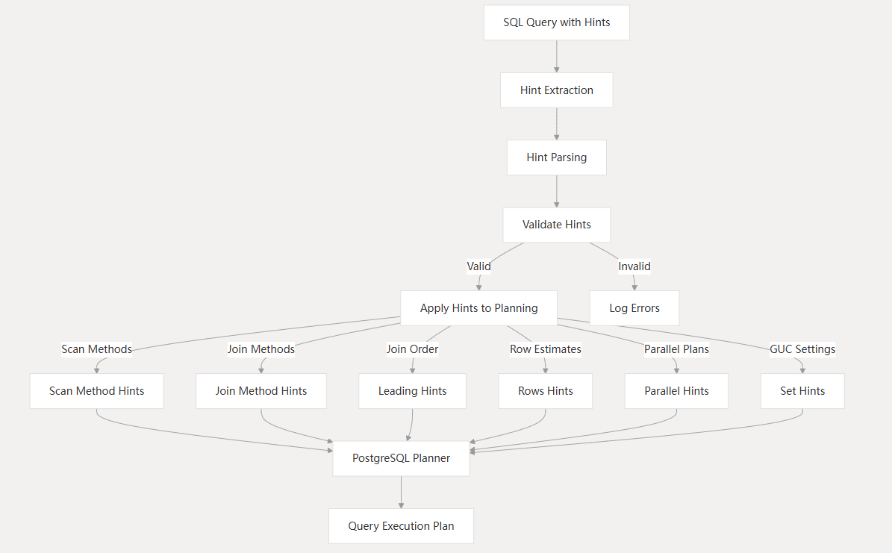

## PostgreSQL优化器提示扩展——pg_hint_plan
PostgreSQL使用基于代价的优化器，代价的计算是基于统计信息，而统计信息的准确性和实时性是需要平衡的，精确度十分高的统计信息也会影响性能，统计信息收集与存储这也是需要消耗资源的，这是需要在工程实现上进行平衡，因为统计信息的误差以及优化器代价计算模型是一个通用的模型，它的首要目标是让大多数场景的SQL生成一个最佳执行计划，但是对某些特殊情况，可能生成的是一个次优的执行计划。那么在已知优化器生成的是非最佳执行计划的情况下，怎么去进行优化呢？可通过优化器提示pg_hint_plan来优化，pg_hint_plan会通过特殊的注释语句提示来调整既定的执行计划，去生成你想要的执行计划。


### 使用场景
当前主流数据库都有优化器提示这个功能，其中Oracle优化器提示功能做的十分强大，那么为什么会有优化器提示这个功能呢？就是为了给开发人员一个机制，当优化器无法生成最佳执行计划时，能够有一种方法可以改变这个执行计划，生成最优执行计划。当前的优化器无法保证所有的SQL生成的执行计划都是最优的。当然，影响执行计划生成的不只是SQL，因为还有数据量，统计信息等都会影响优化器的执行计划生成。

那么什么时候才该用hint呢？当生成的执行计划不符合要求时，我们首先要考虑的是SQL设计的是否合理，比如有没有建索引等，其次看统计信息是否准确，代价模型是否合理，比如硬件不同，相应的代价参数需要进行调整，比如`random_page_cost`参数磁盘与SSD参数就不同，可通过调整GUC参数来改变。最后才是通过hint的方式来调整执行计划，因为这样的方式只能调整一个执行计划，只针对当前hint的SQL有效，并且随着数据量以及统计信息的变化，原有的hint提示的执行计划可能也并不是最优的执行计划，所以采用hint的方式来进行优化需要开发人员进行具体的权衡。


### 使用方法

#### 安装

修改postgresql.conf文件，添加如下内容：
```conf
shared_preload_libraries = 'pg_hint_plan'
pg_hint_plan.enable_hint_table = on
```
安装扩展：
```sql
postgres=# create extension pg_hint_plan ;
CREATE EXTENSION
```

> 当前已支持PostgreSQL 18，如果是PostgreSQL 14，请使用pg_hint_plan 1.4版本。

#### 基础用法
###### 一、语法表示
<font color=blue>hint通过解析SQL语句中特定格式的注释来读取优化器提示信息，具体的提示信息需要以`/*+`开始，以`*/`结尾， 提示短语由提示名称及括号内的参数构成，参数之间使用空格分隔，为了提高可读性，提示短语允许换行。</font>例如`/*+ SeqScan(a) */`表示使用SeqScan方法扫描表a。我们举个例子说明，当然这个例子不一定使用Hint会更优，仅说明一下hint的用法以及效果。
```sql
-- 未使用hint
postgres=# EXPLAIN SELECT * FROM pgbench_branches b JOIN pgbench_accounts a ON b.bid = a.bid ORDER BY a.aid;
                           QUERY PLAN                                                    
------------------------------------------------------------------------
 Nested Loop  (cost=0.57..94043.52 rows=1001393 width=461)
   ->  Index Scan using pgbench_accounts_pkey on pgbench_accounts a  (cost=0.42..70236.02 rows=1001393 width=97)
   ->  Memoize  (cost=0.15..0.16 rows=1 width=364)
         Cache Key: a.bid
         Cache Mode: logical
         ->  Index Scan using pgbench_branches_pkey on pgbench_branches b  (cost=0.14..0.15 rows=1 width=364)
               Index Cond: (bid = a.bid)
(7 rows)
```
使用hint后，变更了执行计划。
```sql
-- 使用hint
postgres=# /*+
     HashJoin(a b)
     SeqScan(a)
    */
   EXPLAIN SELECT * FROM pgbench_branches b JOIN pgbench_accounts a ON b.bid = a.bid ORDER BY a.aid;
                        QUERY PLAN                                        
-------------------------------------------------------------------------
 Sort  (cost=407325.98..409829.46 rows=1001393 width=461)
   Sort Key: a.aid
   ->  Hash Join  (cost=1.23..62937.86 rows=1001393 width=461)
         Hash Cond: (a.bid = b.bid)
         ->  Seq Scan on pgbench_accounts a  (cost=0.00..59193.93 rows=1001393 width=97)
         ->  Hash  (cost=1.10..1.10 rows=10 width=364)
               ->  Seq Scan on pgbench_branches b  (cost=0.00..1.10 rows=10 width=364)
(7 rows)
```
<font color=blue>pg_hint_plan仅解析首个块注释中的提示信息</font>，遇到非字母、数字、空格、下划线、逗号及括号字符时停止解析。下例中，HashJoin(a b)和SeqScan(a)被识别为提示，而IndexScan(a)与MergeJoin(a b)无效：
```sql
postgres=# /*+
     HashJoin(a b)
     SeqScan(a)
    */
   /*+ IndexScan(a) */
   EXPLAIN SELECT /*+ MergeJoin(a b) */ * FROM pgbench_branches b JOIN pgbench_accounts a ON b.bid = a.bid ORDER BY a.aid;
                       QUERY PLAN                                        
-------------------------------------------------------------------
 Sort  (cost=407325.98..409829.46 rows=1001393 width=461)
   Sort Key: a.aid
   ->  Hash Join  (cost=1.23..62937.86 rows=1001393 width=461)
         Hash Cond: (a.bid = b.bid)
         ->  Seq Scan on pgbench_accounts a  (cost=0.00..59193.93 rows=1001393 width=97)
         ->  Hash  (cost=1.10..1.10 rows=10 width=364)
               ->  Seq Scan on pgbench_branches b  (cost=0.00..1.10 rows=10 width=364)
(7 rows)
```
我们看一下日志，可以看到仅SeqScan以及HashJoin被使用了，其他两个hint无效。
```log
2025-07-29 14:41:49.178 CST [13375] DEBUG:  pg_hint_plan:
	used hint:
	SeqScan(a)
	HashJoin(a b)
	not used hint:
	duplication hint:
	error hint:
```

###### 二、在plpgsql中使用

<font color=blue>pg_hint_plan可以在plpgsql中使用，但存在以下限制</font>：
- 提示仅对以下查询类型生效：
    - 返回单行的查询（SELECT、INSERT、UPDATE、DELETE）
    - 返回多行的查询（RETURN QUERY）
    - 动态SQL语句（EXECUTE）
    - 打开游标（OPEN）
    - 遍历查询结果（FOR）
- 提示注释必须紧接在查询首个关键字之后，前置注释不会被视为查询的一部分。
```sql
postgres=# CREATE FUNCTION hints_func(integer) RETURNS integer AS $$
   DECLARE
     id  integer;
     cnt integer;
   BEGIN
     SELECT /*+ NoIndexScan(a) */ aid
       INTO id FROM pgbench_accounts a WHERE aid = $1;
     SELECT /*+ SeqScan(a) */ count(*)
       INTO cnt FROM pgbench_accounts a;
     RETURN id + cnt;
   END;
   $$ LANGUAGE plpgsql;
CREATE FUNCTION
```

###### 三、对象名称大小写处理、特殊字符处理

<font color=blue>与PostgreSQL不同，pg_hint_plan对提示中的对象名采用严格区分大小写的匹配方式。</font>例如，提示中的TBL仅匹配数据库中名为‘TBL’的对象，不会匹配tbl、Tbl等未加引号的变体。


<font color=blue>若提示参数中的对象名包含括号、双引号或空格，需使用双引号包裹，转义规则与PostgreSQL一致。</font>

###### 四、区分多处出现的表

当相同的表名多次出现时，<font color=blue>pg_hint_plan通过别名识别目标对象</font>。此特性可用于精准指定特定表实例：
```sql
=# /*+ HashJoin(t1 t1) */
   EXPLAIN SELECT * FROM s1.t1
     JOIN public.t1 ON (s1.t1.id=public.t1.id);
INFO:  hint syntax error at or near "HashJoin(t1 t1)"
DETAIL:  Relation name "t1" is ambiguous.
...
=# /*+ HashJoin(pt st) */
   EXPLAIN SELECT * FROM s1.t1 st
     JOIN public.t1 pt ON (st.id=pt.id);
                             QUERY PLAN
---------------------------------------------------------------------
 Hash Join  (cost=64.00..1112.00 rows=28800 width=8)
   Hash Cond: (st.id = pt.id)
   ->  Seq Scan on t1 st  (cost=0.00..34.00 rows=2400 width=4)
   ->  Hash  (cost=34.00..34.00 rows=2400 width=4)
         ->  Seq Scan on t1 pt  (cost=0.00..34.00 rows=2400 width=4)
```

###### 五、视图或规则下的表
<font color=blue>hint无法直接作用于视图</font>。 这是因为pg_hint_plan通常是在查询重写阶段之后，执行器之前进行处理，而视图是在查询重写阶段进行处理的，在查询重写阶段视图已经被替换为对应的表，生成的查询树中已经没有视图了。

```sql
postgres=# create view vt2 as select * from t2;
CREATE VIEW
postgres=# /*+ SeqScan(vt2) */ explain select * from vt2 where a = 10;
                            QUERY PLAN                             
-------------------------------------------------------------------
 Index Scan using t2_pkey on t2  (cost=0.29..2.50 rows=1 width=17)
   Index Cond: (a = 10)
(2 rows)

postgres=# /*+ SeqScan(t2) */ explain select * from t2 where a = 10;
                     QUERY PLAN                      
-----------------------------------------------------
 Seq Scan on t2  (cost=0.00..180.00 rows=1 width=17)
   Filter: (a = 10)
(2 rows)
```

###### 六、继承表

<font color=blue>提示仅对父表有效，且会影响所有子表。直接针对子表的提示无效。</font>

###### 七、子查询
对于以下类型的子查询，可通过隐含名`ANY_subquery`来提示：
```sql
    IN (SELECT ... {LIMIT | OFFSET ...} ...)
    = ANY (SELECT ... {LIMIT | OFFSET ...} ...)
    = SOME (SELECT ... {LIMIT | OFFSET ...} ...)
```
例如：
```sql
postgres=# /*+HashJoin(a1 ANY_subquery)*/
   EXPLAIN SELECT * FROM pgbench_accounts a1 WHERE aid IN (SELECT bid FROM pgbench_accounts a2 LIMIT 10);
                          QUERY PLAN                                           
---------------------------------------------------------------
 Hash Semi Join  (cost=0.82..61823.51 rows=10 width=97)
   Hash Cond: (a1.aid = a2.bid)
   ->  Seq Scan on pgbench_accounts a1  (cost=0.00..59193.93 rows=1001393 width=97)
   ->  Hash  (cost=0.69..0.69 rows=10 width=4)
         ->  Limit  (cost=0.00..0.59 rows=10 width=4)
               ->  Seq Scan on pgbench_accounts a2  (cost=0.00..59193.93 rows=1001393 width=4)
(6 rows)
```

###### 八、IndexOnlyScan提示
若指定的索引无法进行仅索引扫描，可能会意外选择其他索引执行索引扫描。

这里补充说明一下，在使用禁止顺序扫描`NoSeqScan`时，并不意味着不会使用顺序扫描，因为顺序扫描是最基础的扫描方式，当其他扫描不可用时，还是会生成顺序扫描。
```sql
-- 表没有索引
postgres=#  \d t4
                 Table "public.t4"
 Column |  Type   | Collation | Nullable | Default 
--------+---------+-----------+----------+---------
 a      | integer |           |          | 
 b      | integer |           |          | 
-- hint提示禁止顺序扫描，但实际上最终还是生成顺序扫描执行计划
postgres=# /*+ NoSeqScan(t4) */ explain select * from t4 where a < 30000;
                               QUERY PLAN                               
------------------------------------------------------------------------
 Seq Scan on t4  (cost=10000000000.00..10000000038.25 rows=753 width=8)
   Filter: (a < 30000)
(2 rows)
```

###### 九、关于NoIndexScan

`NoIndexScan`提示隐含启用`NoIndexOnlyScan`。

###### 十、 并行提示与UNION
UNION只有当所有底层查询都是并行安全的情况下才允许并行。因此，强制对任意可并行安全的子查询进行并行
会让UNION以并行方式执行。

###### 十一、 通过set提示设置pg_hint_plan参数
pg_hint_plan某些参数影响自身行为，因此通过set提示设置的某些参数可能不会像期望的那样工作，比如：
- 修改enable_hint，enable_hint_table的参数会被忽略。
- 在查询执行过程中设置debug_print和message_level参数。


#### 提示表
提示可以通过注释来指定，但在SQL无法编辑的情况下，这种方式便不可用了，这时，可以使用pg_hint_plan提供的提示表。可将提示信息存入表hint_plan.hints中。表结构如下：

| 列 | 描述 |
|:-------|:------------|
| `id` | 提示ID号，唯一且自动生成 |
| `norm_query_string` | 与要提示的查询匹配的模式。所有的常量可被替换为 ？ |
| `application_name` | 应用会话的名称，置空表示任何应用 |
| `hints` | 提示语句 |

```sql
postgres=# \d hint_plan.hints
                                     Table "hint_plan.hints"
      Column       |  Type   | Collation | Nullable |                   Default                   
-------------------+---------+-----------+----------+---------------------------------------------
 id                | integer |           | not null | nextval('hint_plan.hints_id_seq'::regclass)
 norm_query_string | text    |           | not null | 
 application_name  | text    |           | not null | 
 hints             | text    |           | not null | 
Indexes:
    "hints_pkey" PRIMARY KEY, btree (id)
    "hints_norm_and_app" UNIQUE, btree (norm_query_string, application_name)
```

示例：
```sql
posgres=# INSERT INTO hint_plan.hints(norm_query_string, application_name, hints)
     VALUES (
         'EXPLAIN (COSTS false) SELECT * FROM t1 WHERE t1.id = ?;',
         '',
         'SeqScan(t1)');
INSERT 0 1
postgres=# UPDATE hint_plan.hints
     SET hints = 'IndexScan(t1)'
     WHERE id = 1;
UPDATE 1
postgres=# DELETE FROM hint_plan.hints WHERE id = 1;
DELETE 1
```

> 当提示表和注释中的提示同时存在时，提示表优先级高于注释中的提示。


#### 错误处理
在开发测试阶段，建议开启日志，并设置日志级别为DEBUG级别，方便观察错误原因。
```sql
postgres=# set pg_hint_plan.debug_print to on;
SET
postgres=# set pg_hint_plan.message_level to debug1;
SET
```
我们举个例子：
```sql
-- 引用无效表c
postgres=# /*+
     HashJoin(a b c)   
     SeqScan(a)
    */
   EXPLAIN SELECT *
     FROM pgbench_branches b
     JOIN pgbench_accounts a ON b.bid = a.bid
     ORDER BY a.aid;
                        QUERY PLAN                                        
-------------------------------------------------------------
 Sort  (cost=407325.98..409829.46 rows=1001393 width=461)
   Sort Key: a.aid
   ->  Hash Join  (cost=1.23..62937.86 rows=1001393 width=461)
         Hash Cond: (a.bid = b.bid)
         ->  Seq Scan on pgbench_accounts a  (cost=0.00..59193.93 rows=1001393 width=97)
         ->  Hash  (cost=1.10..1.10 rows=10 width=364)
               ->  Seq Scan on pgbench_branches b  (cost=0.00..1.10 rows=10 width=364)
(7 rows)
```
日志中会提示没有使用HashJoin(a b c)，若提示中引用的对象（如表、索引等）定义不正确，相关提示会被静默忽略。此类错误在服务器日志中会标记为`not used hint`。
```log
2025-07-29 11:47:30.100 CST [13375] DEBUG:  pg_hint_plan:
	used hint:
	SeqScan(a)
	not used hint:  
	HashJoin(a b c)
	duplication hint:
	error hint:
```

pg_hint_plan在遇到任何错误时都会停止解析hint，并仅使用已经解析的hint。以下是一些典型的错误类型：
- 语法错误： 任何语法错误或无效的提示名称都会被视为语法错误。
- 不正确的对象定义： 若提示中引用的对象（如表、索引等）定义不正确，相关提示会被静默忽略。
- 冗余或冲突的提示：当存在冗余提示或相互冲突的提示时，仅最后定义的提示生效。此类错误会记录为“重复提示”（duplicated hints）。
- 嵌套注释：提示注释（`/*+ ... */`）不能嵌套。一旦检测到嵌套注释，解析会立即终止，所有已解析的提示将被忽略。


#### 使用注意事项

###### 一、查询优化器GUC参数的影响
如果FROM子句中表的数量超过了`from_collapse_limit`（默认值为8），那么查询优化器将不会尝试优化表连接顺序，此时pg_hint_plan无法影响表连接顺序。

###### 二、强制执行不可行执行计划的提示
当强制执行的计划因条件不满足而无法执行时，查询优化器将会选择任意可执行的计划：
- 尝试对 `FULL OUTER JOIN` 使用嵌套循环（Nested Loop）。
- 使用未被包含的索引。
- 对不含 `ctid` 条件的查询尝试执行 TID 扫描。

###### 三、ECPG中的查询
ECPG（嵌入式 SQL）会移除嵌入式SQL语句中的注释，因此提示无法通过常规方式传递。唯一的例外是 `EXECUTE` 命令，它会将原始查询字符串直接发送到服务器。在此场景下，可以通过hint table来应用提示。

###### 四、查询标识符
启用 `compute_query_id` 后，PostgreSQL生成查询ID时会忽略注释。因此，即使查询包含不同的提示（但主体结构相同），仍可能生成相同的查询ID。 

#### pg_hint_plan配置参数
pg_hint_plan配置参数如下：
| 参数名 | 描述 | 默认值 |
|:---------------|:------------|:--------|
| `pg_hint_plan.enable_hint` | 是否启用`pg_hint_plan`. | `on` |
| `pg_hint_plan.enable_hint_table` | 是否启用提示表功能 | `off` |
| `pg_hint_plan.parse_messages` | 指定提示解析错误的日志级别，有效值： `error`, `warning`, `notice`, `info`, `log`, `debug`. | `INFO` |
| `pg_hint_plan.debug_print` | 控制调试输出详细程度，有效值： `off`, `on`, `detailed` and `verbose`. | `off` |
| `pg_hint_plan.message_level` | 指定调试信息的消息级别.有效值： `error`, `warning`, `notice`, `info`, `log`, `debug`. | `INFO` |

### 支持列表
当前主要支持扫描方法提示、连接方法提示、连接顺序提示、连接行为控制提示、行数校正提示、并行查询提示、GUC参数配置提示等。具体支持如下：
>如未来有更新版本，可查看文档[Hint list](https://github.com/ossc-db/pg_hint_plan/blob/master/docs/hint_list.md)。

| Group | Format | Description |
|:------|:-------|:------------|
| 扫描方法 | `SeqScan(table)`| 强制顺序扫描表table |
| | `TidScan(table)` | 强制TID扫描表table |
| | `IndexScan(table[ index...])` | 强制索引扫描表table，如果指定了索引index，则强制使用该索引 |
| | `IndexOnlyScan(table[ index...])` | 强制通过IndexOnlyScan扫描表table，如果指定了索引index，则强制使用该索引 |
| | `BitmapScan(table[ index...])`| 强制使用位图索引扫描表table，如果指定了索引index，则强制使用该索引 |
| | `IndexScanRegexp(table[ POSIX Regexp...])`<br>`IndexOnlyScanRegexp(table[ POSIX Regexp...])`<br>`BitmapScanRegexp(table[ POSIX Regexp...])` | 强制使用索引扫描、IndexOnlyScan、位图索引扫描表table, 限制使用与Regexp正则表达式匹配的索引，允许通过正则表达式来指定要使用的索引 |
| | `NoSeqScan(table)`| 禁止采用顺序扫描表table |
| | `NoTidScan(table)`| 禁止采用TID扫描表table.|
| | `NoIndexScan(table)`| 禁止采用索引扫描表table. |
| | `NoIndexOnlyScan(table)`| 禁止采用IndexOnlyScan扫描表table. |
| | `NoBitmapScan(table)` | 禁止采用位图索引扫描表table. |
| 连接方法| `NestLoop(table table[ table...])` | 强制对声明的表使用NestLoop进行连接操作 |
| | `HashJoin(table table[ table...])`| 强制对声明的表使用HashJoin进行连接操作 |
| | `MergeJoin(table table[ table...])` | 强制对声明的表使用MergeJoin进行连接操作 |
| | `NoNestLoop(table table[ table...])`| 禁止对声明的表采用NestLoop进行连接操作 |
| | `NoHashJoin(table table[ table...])`| 禁止对声明的表采用HashJoin进行连接操作 |
| | `NoMergeJoin(table table[ table...])` | 禁止对声明的表采用MergeJoin进行连接操作 |
| 连接顺序 | `Leading(table table[ table...])` | 指定连接顺序 |
| | `Leading(<join pair>)`| 强制按照指定的顺序和方向执行连接操作，一个连接对是由括号括起来的，这种结构可以嵌套 |
| 连接行为控制 | `Memoize(table table[ table...])` | 允许在指定表之间的最顶层连接操作中物化中间结果。该提示为非强制 |
| | `NoMemoize(table table[ table...])` | 禁止指定表之间的最顶层连接操作物化中间结果 |
| 行数校正 | `Rows(table table[ table...] correction)` | 校正由指定表组成的联结结果的行数。 可用的校正方法包括绝对值（＃<n>）、加法（+ <n>）、减法（-<n>）和乘法（* <n>）， 其中<n>表示需要指定的行的数量。 |
| 并行执行 | `Parallel(table <# of workers> [soft\|hard])` | 强制或禁止并行执行针对指定表的扫描，<# of workers>是所需的并行度（并行执行的程序数量），其中0表示禁止并行执行。 如果第三个参数是soft（默认），表示仅修改max_parallel_workers_per_gather参数的值，由优化器决定实际的并行度。hard表示强制使用其指定的并行度。 |
| GUC | `Set(GUC-param value)` | 优化器运行时，将GUC参数设置为该值。 |

### 提示类型
当前主要支持扫描方法提示、连接方法提示、连接顺序提示、行数校正提示、并行查询提示、GUC参数配置提示等。



#### 扫描方法提示
扫描方法提示对目标表强制执行特定的扫描方法，pg_hint_plan通过表的别名（如果存在的话）来识别目标表。扫描方法例如：序列扫描、索引扫描等。

扫描提示对普通表、继承表、无日志表、临时表和系统表有效。对外部表、表函数、常量值语句、通用表达式、视图和子查询无效。
```sql
=# /*+
     SeqScan(t1)
     IndexScan(t2 t2_pkey)
    */
   SELECT * FROM table1 t1 JOIN table table2 t2 ON (t1.key = t2.key);
```

#### 连接方法提示
连接方法提示强制指定相关表连接的方法。对普通表、继承表、无日志表、临时表、外部表、系统表、表函数、常量值命令和通用表达式有效。对视图和子查询无效。

#### 连接顺序提示
`Leading`提示强制两个或多个表的连接顺序。
```sql
=# /*+
     NestLoop(t1 t2)
     MergeJoin(t1 t2 t3)
     Leading(t1 t2 t3)
    */
   SELECT * FROM table1 t1
     JOIN table table2 t2 ON (t1.key = t2.key)
     JOIN table table3 t3 ON (t2.key = t3.key);
```

#### 行数校正提示
行数校正提示会校正由查询优化器导致的行数错误。
```sql
=# /*+ Rows(a b #10) */ SELECT... ; 设置连接结果的行数为10
=# /*+ Rows(a b +10) */ SELECT... ; 行数增加10
=# /*+ Rows(a b -10) */ SELECT... ; 行数减去10
=# /*+ Rows(a b *10) */ SELECT... ; 行数增大10倍
```

#### 并行执行提示
`Parallel`提示强制扫描的并行执行配置。第三个参数指定强制强度：soft 表示仅修改 max_parallel_worker_per_gather，其他参数由规划器决定；hard 强制修改其他规划器参数。该提示作用于普通表、分区表父表、UNLOGGED表和系统表。外部表、表函数、VALUES 子句、CTE、视图和子查询无效。视图的内部表可通过真实名称或别名指定。
```sql
=# EXPLAIN /*+ Parallel(c1 3 hard) Parallel(c2 5 hard) */
   SELECT c2.a FROM c1 JOIN c2 ON (c1.a = c2.a);
                                  QUERY PLAN
-------------------------------------------------------------------------------
 Hash Join  (cost=2.86..11406.38 rows=101 width=4)
   Hash Cond: (c1.a = c2.a)
   ->  Gather  (cost=0.00..7652.13 rows=1000101 width=4)
         Workers Planned: 3
         ->  Parallel Seq Scan on c1  (cost=0.00..7652.13 rows=322613 width=4)
   ->  Hash  (cost=1.59..1.59 rows=101 width=4)
         ->  Gather  (cost=0.00..1.59 rows=101 width=4)
               Workers Planned: 5
               ->  Parallel Seq Scan on c2  (cost=0.00..1.59 rows=59 width=4)

=# EXPLAIN /*+ Parallel(tl 5 hard) */ SELECT sum(a) FROM tl;
                                    QUERY PLAN
-----------------------------------------------------------------------------------
 Finalize Aggregate  (cost=693.02..693.03 rows=1 width=8)
   ->  Gather  (cost=693.00..693.01 rows=5 width=8)
         Workers Planned: 5
         ->  Partial Aggregate  (cost=693.00..693.01 rows=1 width=8)
               ->  Parallel Seq Scan on tl  (cost=0.00..643.00 rows=20000 width=4)
```

#### GUC参数配置提示
`Set`提示在查询规划期间临时修改GUC参数。只要不与其他规划方法配置参数冲突，查询规划中的GUC参数可以影响规划。当多个提示修改同一GUC时，最后一个生效。pg_hint_plan的GUC参数也可通过此提示设置，但可能不会生效。

```sql
=# /*+ Set(random_page_cost 2.0) */
   SELECT * FROM table1 t1 WHERE key = 'value';
...
```

### 优化示例

这里我们举一个pg_hint_plan进行优化的示例：

建表，并构造数据：
```sql
postgres=# CREATE TABLE employees (id INT PRIMARY KEY, name TEXT, dept_id INT);
CREATE TABLE
postgres=# INSERT INTO employees SELECT generate_series(1, 1000000), 'Emp' || generate_series(1, 1000000), (random() * 9999 + 1)::int;
INSERT 0 1000000
postgres=# CREATE INDEX idx_employees_dept_id ON employees(dept_id);
CREATE INDEX
```
我们首先进行一个查询，并查看执行计划：
```sql
postgres=# explain analyze select * from employees where name = 'Emp100' order by dept_id;
                                                    QUERY PLAN                                                     
-------------------------------------------------------------------------------------------------------------------
 Sort  (cost=19167.19..19179.69 rows=5000 width=40) (actual time=117.370..117.372 rows=1 loops=1)
   Sort Key: dept_id
   Sort Method: quicksort  Memory: 25kB
   ->  Seq Scan on employees  (cost=0.00..18860.00 rows=5000 width=40) (actual time=0.024..117.364 rows=1 loops=1)
         Filter: (name = 'Emp100'::text)
         Rows Removed by Filter: 999999
 Planning Time: 0.336 ms
 Execution Time: 117.398 ms
(8 rows)

Time: 118.740 ms
```
我们修改这个查询，增加`limit 1`进行限制，这个语句在实际应用中是top N查询，属于比较常用的场景。
```sql
postgres=# explain analyze select * from employees where name = 'Emp100' order by dept_id limit 1;
                                                                    QUERY PLAN                                                                     
---------------------------------------------------------------------------------------------------------------------------------------------------
 Limit  (cost=0.42..5.52 rows=1 width=40) (actual time=959.849..959.850 rows=1 loops=1)
   ->  Index Scan using idx_employees_dept_id on employees  (cost=0.42..25453.42 rows=5000 width=40) (actual time=959.847..959.847 rows=1 loops=1)
         Filter: (name = 'Emp100'::text)
         Rows Removed by Filter: 641828
 Planning Time: 0.313 ms
 Execution Time: 959.878 ms
(6 rows)

Time: 961.651 ms
```
经过上面的对比，我们发现增加了`limit 1`后，执行时间明显增加了很多，这显然是不合理的，这是因为优化器在`order by limit`的场景下，优先走了索引，但实际上，这个索引字段并不是where条件字段，在走索引的情况下，大量的数据被过滤掉，导致执行时间大大增加。怎么解决这个问题呢？其中一个思路就是通过pg_hint_plan强制通过顺序扫描表。
```sql
postgres=# /*+ SeqScan(employees) */ explain analyze select * from employees where name = 'Emp100' order by dept_id limit 1;
                                                       QUERY PLAN                                                        
-------------------------------------------------------------------------------------------------------------------------
 Limit  (cost=18885.00..18885.00 rows=1 width=40) (actual time=133.905..133.907 rows=1 loops=1)
   ->  Sort  (cost=18885.00..18897.50 rows=5000 width=40) (actual time=133.903..133.904 rows=1 loops=1)
         Sort Key: dept_id
         Sort Method: quicksort  Memory: 25kB
         ->  Seq Scan on employees  (cost=0.00..18860.00 rows=5000 width=40) (actual time=0.036..133.865 rows=1 loops=1)
               Filter: (name = 'Emp100'::text)
               Rows Removed by Filter: 999999
 Planning Time: 0.223 ms
 Execution Time: 133.933 ms
(9 rows)

Time: 135.182 ms
```
可以看到，通过顺序扫描表后，查询执行时间回归到正常值。
```sql
postgres=# select * from employees where name = 'Emp100' order by dept_id limit 1;
 id  |  name  | dept_id 
-----+--------+---------
 100 | Emp100 |    6428
(1 row)

Time: 893.404 ms
postgres=# /*+ SeqScan(employees) */ select * from employees where name = 'Emp100' order by dept_id limit 1;
 id  |  name  | dept_id 
-----+--------+---------
 100 | Emp100 |    6428
(1 row)

Time: 169.947 ms
```

> 可以关注一下SQL Plan Baseline技术

### 实现原理
我们分析一下pg_hint_plan的实现原理，看一下内核中是如何处理提示的。

主要处理流程：
1. 扩展加载时注册钩子函数和配置参数
```c++
void _PG_init(void)
{
    DefineCustomBoolVariable("pg_hint_plan.enable_hint", ...);
    // 省略部分GUC配置参数...

    // 注册钩子函数
	  prev_planner = planner_hook;
	  planner_hook = pg_hint_plan_planner;    
    // 省略部分钩子函数注册...
}
```
2. 查询执行时，pg_hint_plan_planner钩子被调用
```c++
// 该函数主要是从注释或提示表中获取提示信息，并设置HintState
static PlannedStmt *pg_hint_plan_planner(Query *parse, const char *query_string, int cursorOptions, ParamListInfo boundParams)
{
    // 获取当前SQL的提示信息
    // 1. 如果开启了提示表功能，则从提示表中获取提示信息
    // 2. 如果未开启提示表功能或者提示表中没有提示信息，则从注释中获取提示信息
    get_current_hint_string(parse, query_string, NULL);
    {
        // 1. 如果开启了提示表功能，则从提示表中获取提示信息
        // 2. 如果未开启提示表功能或者提示表中没有提示信息，则从注释中获取提示信息
        // 3. 提取的方式为字符串匹配
        current_hint_str = get_hints_from_comment(query_str);
    }

    // 设置HintState，解析hint字符串中的Hint名以及参数
    HintState	   *hstate = create_hintstate(parse, pstrdup(current_hint_str));
}
```
3. 从注释或提示表中获取提示信息
4. 解析提示信息并存储在HintState中
5. 在查询规划过程中，其他钩子函数会根据提示调整执行计划
6. 查询执行完毕后清理提示状态


#### 扫描方法提示实现原理

对扫描方法提示的实现是在`pg_hint_plan_set_rel_pathlist`函数中实现的。

在查询优化中，会先调用`set_rel_pathlist`生成基表的最短路径，也就是会生成基表的所有扫描方式的路径：顺序扫描、索引扫描、TID扫描。
```c++
static void set_rel_pathlist(PlannerInfo *root, RelOptInfo *rel, Index rti, RangeTblEntry *rte)
{
    // 生成基表所有扫描方式路径
    set_plain_rel_pathlist(root, rel, rte);

    // 走之前注册的钩子函数pg_hint_plan_set_rel_pathlist
    // 处理扫描路径
    if (set_rel_pathlist_hook)
        (*set_rel_pathlist_hook) (root, rel, rti, rte);    
}
```
那么扫描方式提示的核心实现思路是什么呢？
1. SeqScan： 如果指定顺序扫描，则设置`enable_seqscan = true`，其他扫描方式GUC参数设置为false，例如`enable_indexscan = false`
2. 如果是指定索引扫描，则设置`enable_indexscan = true`，其他扫描方式为false，例如`enable_seqscan = false`
3. 其他依次类推。
4. 如果限制使用某个索引进行扫描，则修改`rel->indexlist`，将不希望使用的索引过滤掉。这里的`rel->indexlist`为`RelOptInfo->indexlist`字段，存储了基表的所有可用的索引信息。这个值是在`query_planner`->`build_simple_rel`->`get_relation_info`中获取的。


钩子函数实现如下：
```c++
void pg_hint_plan_set_rel_pathlist(PlannerInfo * root, RelOptInfo *rel, Index rti, RangeTblEntry *rte)
{
    setup_hint_enforcement(root, rel, NULL, &phint)    
    {
        // 限制扫描方式，根据hint提示，修改GUC参数
        // 如果指定顺序扫描，则enable_seqscan为true，enable_indexscan等为false
        // 其他扫描方式依次类推
        setup_scan_method_enforcement(shint, current_hint_state);

        // 限制可以使用的索引，将不期望使用的索引过滤掉
        // 如果是SeqScan或者TidScan，则将rel->indexlist设置为空
        // 其实顺序扫描这种方式是不会被删除的，因为它是最基本的扫描方式
        restrict_indexes(root, shint, rel, using_parent_hint);
    }

    // 根据hint提示修改后，重新生成基本路径
    set_plain_rel_pathlist(root, rel, rte);
}

static void restrict_indexes(PlannerInfo *root, ScanMethodHint *hint, RelOptInfo *rel, bool using_parent_hint)
{
    // 如果是SeqScan或者TidScan，则将rel->indexlist设置为空
    if (hint->enforce_mask == ENABLE_SEQSCAN || hint->enforce_mask == ENABLE_TIDSCAN)
    {
        list_free_deep(rel->indexlist);
        rel->indexlist = NIL;
        hint->base.state = HINT_STATE_USED;

        return;
    }  

    // 遍历基表所有的索引
    foreach (cell, rel->indexlist)
    {
        IndexOptInfo   *info = (IndexOptInfo *) lfirst(cell);
        char		   *indexname = get_rel_name(info->indexoid);
        ListCell	   *l;
        bool			use_index = false;
        
        // 遍历hint提示中的索引
        foreach(l, hint->indexnames)
        {
            char   *hintname = (char *) lfirst(l);
            bool	result;

            // 如果名称匹配，则result为ture
            if (hint->regexp)
                result = regexpeq(indexname, hintname);
            else
                result = RelnameCmp(&indexname, &hintname) == 0;

            if (result)
            {
                use_index = true;  // 表示这个索引是期望被使用的
                break;
            }

            // 如果索引期望被使用，则不从列表中删除，否则删除掉
            if (!use_index)
			          rel->indexlist = foreach_delete_current(rel->indexlist, cell);
        }
    }
}
```

调用栈：
```c++
pg_hint_plan.so!pg_hint_plan_set_rel_pathlist(PlannerInfo * root, RelOptInfo * rel, Index rti, RangeTblEntry * rte) (contrib\pg_hint_plan\pg_hint_plan.c:4718)
set_rel_pathlist(PlannerInfo * root, RelOptInfo * rel, Index rti, RangeTblEntry * rte) (src\backend\optimizer\path\allpaths.c:541)
set_base_rel_pathlists(PlannerInfo * root) (src\backend\optimizer\path\allpaths.c:353)
make_one_rel(PlannerInfo * root, List * joinlist) (src\backend\optimizer\path\allpaths.c:223)
query_planner(PlannerInfo * root, query_pathkeys_callback qp_callback, void * qp_extra) (src\backend\optimizer\plan\planmain.c:276)
grouping_planner(PlannerInfo * root, double tuple_fraction) (src\backend\optimizer\plan\planner.c:1442)
subquery_planner(PlannerGlobal * glob, Query * parse, PlannerInfo * parent_root, _Bool hasRecursion, double tuple_fraction) (src\backend\optimizer\plan\planner.c:1019)
standard_planner(Query * parse, const char * query_string, int cursorOptions, ParamListInfo boundParams) (src\backend\optimizer\plan\planner.c:402)
plan_filter.so!limit_func(Query * parse, const char * queryString, int cursorOptions, ParamListInfo boundParams) (contrib\pg_plan_filter\plan_filter.c:134)
pg_hint_plan.so!pg_hint_plan_planner(Query * parse, const char * query_string, int cursorOptions, ParamListInfo boundParams) (contrib\pg_hint_plan\pg_hint_plan.c:3170)
planner(Query * parse, const char * query_string, int cursorOptions, ParamListInfo boundParams) (src\backend\optimizer\plan\planner.c:269)
pg_plan_query(Query * querytree, const char * query_string, int cursorOptions, ParamListInfo boundParams) (src\backend\tcop\postgres.c:850)
pg_plan_queries(List * querytrees, const char * query_string, int cursorOptions, ParamListInfo boundParams) (src\backend\tcop\postgres.c:942)
exec_simple_query(const char * query_string) (src\backend\tcop\postgres.c:1136)
PostgresMain(int argc, char ** argv, const char * dbname, const char * username) (src\backend\tcop\postgres.c:4606)
BackendRun(Port * port) (src\backend\postmaster\postmaster.c:4539)
BackendStartup(Port * port) (src\backend\postmaster\postmaster.c:4261)
ServerLoop() (src\backend\postmaster\postmaster.c:1748)
PostmasterMain(int argc, char ** argv) (src\backend\postmaster\postmaster.c:1420)
main(int argc, char ** argv) (src\backend\main\main.c:211)
```

#### 连接方法提示实现原理
表连接方法提示的实现原理主要是通过设置`enable_hashjoin`、`enable_mergejoin`、`enable_nestloop`参数来实现的。我们看一下其源码实现。进行表连接时会调用`make_one_rel`函数，生成最终的连接路径。
```c++
RelOptInfo *make_one_rel(PlannerInfo *root, List *joinlist)
{
    // 获取基表扫描方式
	  set_base_rel_pathlists(root);

    // 获取连接路径
	  RelOptInfo *rel = make_rel_from_joinlist(root, joinlist);
    {
         // 钩子，走pg_hint_plan_join_search
        if (join_search_hook)
          return (*join_search_hook) (root, levels_needed, initial_rels);
        else if (enable_geqo && levels_needed >= geqo_threshold)
          return geqo(root, levels_needed, initial_rels);
        else
          return standard_join_search(root, levels_needed, initial_rels);     
    }
}
```
我们看一下`pg_hint_plan_join_search`函数的实现：
```c++
pg_hint_plan_join_search(PlannerInfo *root, int levels_needed, List *initial_rels)
--> pg_hint_plan_standard_join_search(root, levels_needed, initial_rels);
    --> join_search_one_level(root, lev);
        --> make_rels_by_clause_joins(root, old_rel, other_rels_list, other_rels);
            --> make_join_rel_wrapper(PlannerInfo *root, RelOptInfo *rel1, RelOptInfo *rel2)
                --> set_join_config_options(join_hint->enforce_mask, false, current_hint_state->context);

```
`make_join_rel_wrapper`函数中会调用函数`set_join_config_options`设置连接相关的GUC参数，比如HashJoin提示，就设置`enable_hashjoin=true`，其他连接方式设置为false，比如`enable_nestloop=false`。

调用栈：
```c++
pg_hint_plan.so!set_join_config_options(unsigned char enforce_mask, _Bool set_memoize, GucContext context) (contrib\pg_hint_plan\pg_hint_plan.c:2781)
pg_hint_plan.so!make_join_rel_wrapper(PlannerInfo * root, RelOptInfo * rel1, RelOptInfo * rel2) (contrib\pg_hint_plan\pg_hint_plan.c:4486)
pg_hint_plan.so!make_rels_by_clause_joins(PlannerInfo * root, RelOptInfo * old_rel, List * other_rels_list, ListCell * other_rels) (contrib\pg_hint_plan\core.c:824)
pg_hint_plan.so!pg_hint_plan_join_search_one_level(PlannerInfo * root, int level) (contrib\pg_hint_plan\core.c:634)
pg_hint_plan.so!pg_hint_plan_standard_join_search(PlannerInfo * root, int levels_needed, List * initial_rels) (contrib\pg_hint_plan\core.c:496)
pg_hint_plan.so!pg_hint_plan_join_search(PlannerInfo * root, int levels_needed, List * initial_rels) (contrib\pg_hint_plan\pg_hint_plan.c:4659)
make_rel_from_joinlist(PlannerInfo * root, List * joinlist) (src\backend\optimizer\path\allpaths.c:2948)
make_one_rel(PlannerInfo * root, List * joinlist) (src\backend\optimizer\path\allpaths.c:228)
query_planner(PlannerInfo * root, query_pathkeys_callback qp_callback, void * qp_extra) (src\backend\optimizer\plan\planmain.c:276)
grouping_planner(PlannerInfo * root, double tuple_fraction) (src\backend\optimizer\plan\planner.c:1442)
subquery_planner(PlannerGlobal * glob, Query * parse, PlannerInfo * parent_root, _Bool hasRecursion, double tuple_fraction) (src\backend\optimizer\plan\planner.c:1019)
standard_planner(Query * parse, const char * query_string, int cursorOptions, ParamListInfo boundParams) (src\backend\optimizer\plan\planner.c:402)
plan_filter.so!limit_func(Query * parse, const char * queryString, int cursorOptions, ParamListInfo boundParams) (contrib\pg_plan_filter\plan_filter.c:134)
pg_hint_plan.so!pg_hint_plan_planner(Query * parse, const char * query_string, int cursorOptions, ParamListInfo boundParams) (contrib\pg_hint_plan\pg_hint_plan.c:3170)
planner(Query * parse, const char * query_string, int cursorOptions, ParamListInfo boundParams) (src\backend\optimizer\plan\planner.c:269)
pg_plan_query(Query * querytree, const char * query_string, int cursorOptions, ParamListInfo boundParams) (src\backend\tcop\postgres.c:850)
```

#### GUC参数配置提示实现原理

`Set`提示的实现比较简单，更改GUC参数。
```c++
static PlannedStmt *pg_hint_plan_planner(Query *parse, const char *query_string, int cursorOptions, ParamListInfo boundParams)
{
    // 1. 从注释或提示表中获取提示信息，并设置HintState
    
    // 2. 处理Set hint提示，内部会调用set_config_option设置GUC参数
		setup_guc_enforcement(current_hint_state->set_hints,
							   current_hint_state->num_hints[HINT_TYPE_SET],
							   current_hint_state->context);  
 
    // 3. 调用查询优化器
		if (prev_planner)
			result = (*prev_planner) (parse, query_string,
									  cursorOptions, boundParams);
		else
			result = standard_planner(parse, query_string,
									  cursorOptions, boundParams); 

}                 
```


### 开源情况

github: https://github.com/ossc-db/pg_hint_plan.git
star: 805
最近提交：2025年6月30日
开源协议：
```txt 
在满足以下条件的情况下，允许以源代码和二进制形式重新分发和使用，无论是否进行了修改：

源代码的再分发必须保留上述版权声明、本条件列表以及以下免责声明。
以二进制形式再分发时，必须在随发行版提供的文档和/或其他材料中包含上述版权声明、本条件列表以及以下免责声明。
未经事先书面许可，不得使用日本电信电话公司（NTT）或其贡献者的名称来为本软件派生的产品背书或推广。
```
版本：当前最高支持PG17版本


---

参考文档：      
[pg_hint_plan](https://help.aliyun.com/zh/polardb/polardb-for-postgresql/pg-hint-plan-1?spm=a2c4g.11186623.help-menu-2249963.d_7_23.6d903956NushSu&scm=20140722.H_434033._.OR_help-T_cn~zh-V_1)
[SQL优化：一篇文章说清楚Oracle Hint的正确使用姿势](https://cloud.tencent.com/developer/article/1536900)
[PolarDB对ordering index代价计算的改进](http://mysql.taobao.org/monthly/2025/01/07/)
